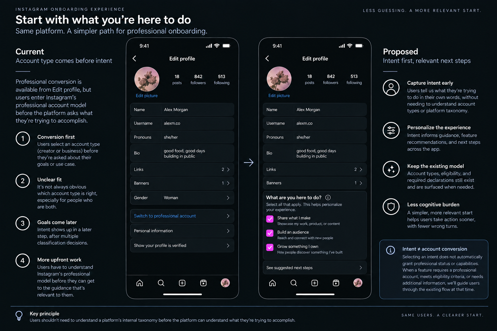
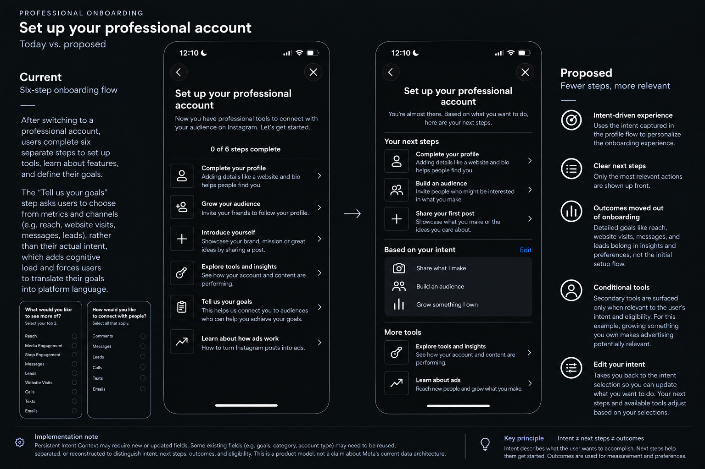

# Account Onboarding and Intent

> **About this study:** This independent product study examines a broader account-onboarding problem using Instagram professional onboarding as the case environment. It began with my own experience setting up Instagram accounts for a product I built, then expanded through direct exploration of Instagram's current onboarding flows and published product information. Where the underlying platform behavior is unknown, I treat it as an assumption rather than a fact.

## The starting point

I built and launched an iOS app, then encountered a second problem: figuring out how to use Instagram to grow it.

I wasn't approaching Instagram only as a person, a traditional business, or a content creator.

I was all three at once.

I owned the product. I created the content. Sometimes I appeared in the content. I wanted to build an audience around what I was making and ultimately help interested people find the product.

Instagram made creating an account easy.

Understanding how I should configure and use that account was harder.

Was I a business because I owned a product?

A creator because I personally made its content?

Both?

That led to the broader product question:

> **How might a platform reduce onboarding burden when a user's real-world intent doesn't map cleanly to its account classifications?**

Direct exploration changed the scope of this study: several initial assumptions did not hold up, so the final proposal focuses only on the onboarding and classification problem I could substantiate.

---

## What I encountered

Creating another Instagram account from an existing account required very little upfront configuration.

Professional conversion was available from Edit Profile, but intent came later in the journey.

To configure the professional experience, I encountered decisions around account type, category, professional setup, goals, tools, and capabilities.

Some of those decisions were difficult to map to my situation as a solo founder.

The problem wasn't that those distinctions necessarily lack meaning inside Instagram.

The problem was that I had to understand enough of Instagram's model to decide where I belonged in it before the platform knew much about what I was trying to accomplish.

---

## Why this may matter

My experience doesn't establish how common this problem is.

But this transition is worth investigating because someone moving toward professional use may be trying to understand how a platform can help them accomplish something beyond personal participation.

If other users experience the same translation problem, asking them to navigate account type, category, professional setup, and platform-defined goals before their intent is understood may lead them to:

- choose classifications or goals without understanding their implications
- overlook tools relevant to what they're trying to accomplish
- spend additional effort configuring the platform before reaching a meaningful action
- receive onboarding or guidance that is less relevant to their actual intent

Those are hypotheses, not measured outcomes.

The first investment question therefore isn't:

> **Should Instagram build Persistent Intent Context?**

It's:

> **Is this translation problem common and consequential enough to solve?**

I would validate prevalence and impact before committing significant engineering investment.

---

## Goals require another translation

Instagram's professional setup includes a **Tell us your goals** step.

The options I encountered included outcomes and interaction channels such as:

**Reach · Media engagement · Shop engagement · Messages · Leads · Website visits · Calls · Texts · Emails**

Those can all be useful things to measure or optimize.

But they aren't how I would naturally describe why I was using Instagram.

My intent was closer to:

**Share what I make · Build an audience · Grow something I own**

That distinction became the basis of the redesign.

> **Intent describes what the user wants to accomplish. Outcomes describe how the platform may observe progress. Next steps describe what the user can do now.**

---

## The product decision

### Capture intent before asking users to navigate the professional model

Instead of introducing another account type or assuming Instagram's existing classifications can disappear, capture a small amount of persistent intent during profile setup.

For this scenario:

**Share what I make**  
**Build an audience**  
**Grow something I own**

In the proposed experience, **Grow something I own** is framed around helping people discover something the user has built rather than requiring the user to translate that intent into a platform-defined outcome.

Relationships should also be able to overlap. A solo founder may both:

**Own or run it**  
**Create content for it**

The user describes their reality.

The platform remains responsible for translating that context into whatever classifications, policies, eligibility rules, and capabilities it requires.

---

## Proposed profile experience

The proposal adds intent alongside Instagram's existing profile context rather than redesigning its category taxonomy.

**Category:** what kind of account or content is this?

**Intent:** what is this person trying to accomplish?

Professional conversion still exists where required.

Intent can begin personalizing the experience before the user needs to understand every part of that model.

> **Intent informs the experience. It does not grant professional status or override eligibility.**

---

## Reduce the second onboarding journey

Instagram currently introduces a six-step professional setup flow after conversion:

**Complete your profile · Grow your audience · Introduce yourself · Explore tools and insights · Tell us your goals · Learn about how ads work**

If intent has already been captured, the platform can separate three things that are currently mixed together.

### Your next steps

**Complete your profile**  
**Build your audience**  
**Share your first post**

These answer:

> **What can I do now?**

### Based on your intent

**Share what I make**  
**Build an audience**  
**Grow something I own**

These answer:

> **What am I trying to accomplish?**

### More tools

**Explore tools and insights**

Other tools, such as advertising, should surface only when relevant to the user's intent and eligibility.

The objective isn't to hide capabilities.

It's to avoid making every capability part of everyone's onboarding.

---

## Intent ≠ next steps ≠ outcomes

This distinction is the core of the proposal.

### Intent

What is the user trying to accomplish?

**Share what I make · Build an audience · Grow something I own**

### Next steps

What can the user do now?

**Complete profile · Build audience · Share first post**

### Outcomes

How might the platform observe progress?

**Reach · Engagement · Website visits · Messages · Leads**

The proposal doesn't remove those outcomes.

It changes who carries the translation burden.

> **Users express intent. The platform maps that context to relevant next steps, outcomes, tools, and capabilities.**

---

## System boundary

Persistent intent would become reusable product context rather than an onboarding answer that disappears after setup.

Conceptually:

**Intent + relationship**  
↓  
**Existing platform state**  
↓  
**Eligibility / policy / capability resolution**  
↓  
**Relevant experience**

This does **not** assume Creator/Business classifications or other platform state can disappear internally.

Legal, licensing, advertising, commerce, API, safety, or other dependencies may require classifications and declarations that aren't visible from the user experience.

The proposal is narrower:

> **Reduce how much of the internal model the user must understand before the platform can begin responding to their intent.**

---

## Implementation considerations

Persistent Intent Context would likely require changes beyond the interfaces shown here.

Existing fields may need to be reused, separated, or reconstructed, and new state may be required to distinguish:

- **Intent**
- **Relationship**
- **Next steps**
- **Outcomes**
- **Eligibility and policy state**

Existing account-type, category, goal, and professional-tool models may also have downstream dependencies that aren't visible from the interface.

**The proposed experience is a product model, not a claim about Meta's current data architecture.**

---

## Alternatives I rejected

### Add another account type

A hybrid **Creator Business** classification would recreate the same classification problem and assume knowledge of Instagram's backend dependencies that I don't have.

### Remove Creator and Business internally

Difficulty choosing between them doesn't establish that the distinction lacks value elsewhere in the platform.

### Classify every post

A founder can create personal, founder-led, product-led, and promotional content from the same account. Requiring repeated classification would trade one form of cognitive burden for another.

### Infer intent from behavior

Behavioral inference could reduce explicit questions, but it would also make the model less transparent. For this proposal, intent is explicitly provided and editable by the user.

### Rebuild the category taxonomy

Category may support downstream systems this study cannot observe. Intent is therefore modeled as separate context rather than a replacement for Category.

---

## What I would validate

Customer 0 evidence can identify a problem. It cannot establish its prevalence.

Before investing further, I would test:

- Do other founders, creators, businesses, and hybrid users experience the same translation problem?
- Can users express intent more confidently than they can select an account classification?
- Which intents are durable enough to store as persistent context?
- Does capturing intent early remove more onboarding work than it adds?
- Can professional capabilities be introduced progressively without becoming harder to discover?
- Where do intent and platform eligibility conflict?
- Which existing systems depend on fields this model would change?

The primary guardrail would be **cumulative cognitive burden**.

> **If the redesign asks more questions, creates more interruptions, or makes useful capabilities harder to discover, it has failed.**

---

## Scope and limitations

This study does not establish that the problem is widespread, that the proposed intent taxonomy is correct, or that Meta's current architecture could support the model unchanged.

It also does not assume intent can replace account classification, legal or commercial declarations, policy enforcement, or eligibility.

Those are constraints to investigate, not details to design around from the outside.

---

## The principle

**Users shouldn't need to understand a platform's internal taxonomy before the platform can understand what they're trying to accomplish.**

## Research

- [Research findings](research/findings.md) — Current Instagram onboarding behavior, professional account model, evidence, constraints, and sources.
- [Product reasoning log](research/reasoning-log.md) — Hypotheses, corrections, rejected directions, reframing, and decision process.
